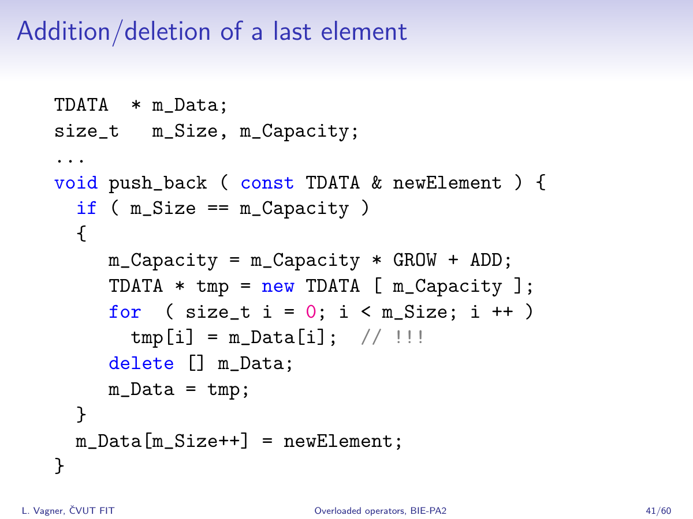

= Assignment 1

**`vector` and `new[] expression`: Implementation of a simple form of a vector class with the `new[]` expression — how `vector` should not be implemented.**

== Assignment

Implement the class template `vector` in the `epc` namespace with the following interface:

[source,c++]
----
template <typename T>
class vector
{
public:
  vector() noexcept; // <1>

  vector(const vector&); // <2>
  vector& operator=(const vector&); // <3>

  ~vector(); // <4>

  T* data(); // <5>
  const T* data() const; // <5>

  T& operator; // <6>
  const T& operator const; // <6>

  void push_back(const T&); // <7>
  void pop_back(); // <8>

  void reserve(size_t); // <9>

  size_t capacity() const; // <10>
  size_t size() const; // <11>

  void swap(vector&) noexcept; // <12>
};
----

<1> Default constructor
<2> Copy constructor
<3> Copy assignment operator
<4> Destructor
<5> Pointer to first element
<6> Reference to desired element
<7> Element insertion
<8> Size reduction
<9> Capacity extension
<10> Information about capacity
<11> Information about number of elements
<12> Content swapping

NOTE: Details about the interface are in the following section.

== Application programming interface (API)

=== Template parameters

* `T` — *value type*
** The value type may not thorw an exception when objects are destructed (`T` is so-called “no-throw-destructible”).

=== Special member functions

* `vector()` — *default constructor*
** Sets the vector into the empty state, i.e., state, where it does not contain any elements and its capacity is zero.
** Must not throw exceptions.

IMPORTANT: From the above requirements, it implies that the default constructor may not create any objects of the value type and may not allocate memory.

* `vector(const vector&)` — *copy constructor*
** The target vector have, after the operation, the same content (owned elements) as the source vector.
** The state of the source vector is not changed.

* `operator=(const vector&)` — *copy assignment operator*
** The target vector have, after the operation, the same content (owned elements) as the source vector.
** The state of the source vector is not changed.

IMPORTANT: Copy assignment operator needs to work correctly even in the case where the source and target vectors represent the same object (so-called “self-assignment”).

* `~vector()` — *destructor*
** If needed, destructs all the vector elements and deallocates memory.

=== Elements access

* `data()` — *pointer to the first element*
** If the vector contains some elements, returns a pointer to the first of them.
** If the vector does not contain any elements and its capacity is nonzero, returns a pointer to the allocated array.
** If the vector does not contain any elements and its capacity zero, returns a null pointer.

NOTE: The function exits in two variants, i.e., as a _(non-constant) member function_ and a _constant member function_.

* `operator[]` — *reference to the desired element*
** If the vector contains the element with the index `i`, i.e., `i < size()` holds, returns a reference bound to this element.
** Otherwise, the behavior is undefined.

NOTE: The operator exits in two variants, i.e., as a _(non-constant) member function_ and a _constant member function_.

=== Elements insertion

* `push_back(const T& value)` — *inserts element*
** Inserts, at the end of the vector, a copy of the object to which the reference `value` is bound.
** If, before the element insertion, the size of the vecotor is equal to its capacity, the capacity is first extended by peforming so-called “reallocation”; see the description of the `reserve` member function.
** The capacity extension inside `push_back` is performed according to the following rules:
*** If the original capacity is zero, the new capcity is set to 1.
*** Otherwise, the capacity will be exactly doubled.

=== Size reduction

* `pop_back()` — *reduces vector size*
** If the vector is non-empty, reduces its size by 1.
** Otherwise, the behavior is undefined.

=== Capcity extension

* `reserve(size_t capacity)` — *extends vector capacity*
** If `capacity` is lower than or equal to the actual vector's capacity, the function has no effects.
** Otherwise, extends the capacity of the vector to `capacity` by performing “reallocation” and preserves its contents.
** Reallocation works in the following steps:
... A new dynamic array of objects of the value type is allocated by the `new[]` expression. 
... The current vector elements are copied from the original array to the newly allocated array by using the _copy assignment operator_.
... The original array is destructed/deallocated by the `delete[]` expression.
... The internal vector variables are set such that their state correspond with the new array and the new capacity.

[NOTE]
====
This form of vector reallocation stems from the description of the implementation of dynamic arrays as presented in the BIE-PA2 course. The copy of the corresponding slide form the course lectures which shows the `push_back` member function:

====

WARNING: The shown implementation does not care about exceptions.

=== Information about vector

* `capacity()` — *information about capacity*
** Returns information about the vector's capacity, i.e., the size of the array that was last time allocated by the `new[]` expression.

* `size()` — *information about element count*
** Returns information about the vector's size, i.e., the number of elements that the vector owns/manages.

=== Content swapping

* `swap(vector& other)` — *swaps contents of two vectors*
** Swaps the content of two vectors, i.e., the vector `+*this+`, after the operation, will contain the same elements that the vector `other` had before, and vice versa.

IMPORTANT: This operation must not throw an exception.

== Exceptions

* All the implemented vector operations correctly handle exceptoins.
* These may be thrown, for instance, when memory is allocated, or during an operation performed with vector elements (their copying etc.).
* If it is not required otherwise then, after an exception has been caught in the body of some vector function, this exceptoin must be rethrown to the place where that function was called.

=== Exception-safety guarantees

* In case that a vector function call throws an exception, the following rules apply:
** If it is not required otherwise then the _state_ — or the _content_ at least — of the vector will remain unchanged (so-called “strong exception guarantee”).
** Otherwise, the vector content will be _unspecified_ and its state will be _valid_ (so-called “basic exception guarantee”). It is possible to use that vector afterwards and this use may not cause incorrect program behavior.

=== Vector state and content

* As a *vector content*, it is considered the content of its elements and their count. A part of vector content is, for example, neither the address of the allocated array nor its capacity. Two distinct vectors may have the same content (e.g., as a result of a successfull copy operation).
* As a *vector state*, it is considered a complete state of the vector object. In practice, this includes the vector content, the address and capacity of the allocated array, or other internal class data. Two distinct vectors cannot be in the same state if at least one of them has nonzero capacity.

[NOTE]
.Examples
====
* If, inside the `reserve` function call, an exception is thrown when elements are copied from the original into the newly allocated array, the vector state should not change.
* If, inside the `push_back` function call, the reallocation is successfully performed and then, the insertion of the new element throws an exception, the vector content should be preserved, but its state may be changed (elements may be located in the newly allocated array with higher capacity).
====

---

== Submission deadline

* The deadline for the submission of the solution of the 1st assignment is the end of the calendar week in which the 2nd practical class is scheduled.

== Solution

* As a solution, it is considered the implementation of the `epc::vector` class template located exclusively in the `vector.h` file in the root directory of the _assignment1_ branch of your course project on the faculty GitLab server.
* As a correct solution, it is considered compilable, working, and efficient implementation of the epc::vector` class template that satisfies all the requirements defined on this page as well as on the xref:index#[Assignments] page.

== Classification

* The maximum number of classification points is 10.
* The subject of classification is only the way of how the `epc::vector` class tempalte is implemented.

---

== Exemplary implementation deficiencies

* This section shows some examples of implementation deficiencies which appeared in the real student solutions in previous semesters.
* Up to some exceptions, these are serious deficiencies that result in the reduced classification.

=== Types of deficiencies

A++.++ Errors:: Severe deficiencies that may result in compilation or runtime errors (e.g., incorrect program state).
B++.++ Efficiency:: Deficiencies related to the lower efficiency of the vector use during program run (e.g., unnecessary wasting of memory or processor resources).

C++.++ Other:: Deficiencies that does not fall into previous categories.

=== Examples

[tabbed]
A.1::
+
[source,c++]
----
void push_back(const T& value) {
  ...  // reallocation
  data_[size_++] = value;
}
----

A.2::
+
All `#include` directives:
+
[source,c++]
----
#include <cstdlib>
----
+
A part of a member function body:
+
[source,c++]
----
try {
  ... // code that may throw
}
catch (const std::exception& e) {
  ... // necessary clean-up
  throw e;
}
----

A.3::
+
A part of a member function body:
+
[source,c++]
----
try {
  ... // code that may throw
}
catch (...) {
  ... // necessary clean-up
  throw std::current_exception();
}
----

A.4::
+
[source,c++]
----
vector(const vector& other) {
  ... // irrelevant code            
  try {
    std::copy(other.data_, other.data_ + other.size_, data_);
  }
  catch (...) {
    this->~vector();
    throw;
  }
}
----

A.5::
+
Member variables definition:
+
[source,c++]
----
T* data_;
size_t capacity_;
size_t size_;
----
+
Copy constructor:
+
[source,c++]
----
vector(const vector& other) {
  ... // irrelevant code            
  try {
    data_ = new T[other.capacity_];
    for (size_t i = 0; i < other.size_; i++)
      data_[i] = other.data_[i];
  }
  catch(...) {
    delete[] data_;
    throw;
  }
}
----

A.6::
+
Member variables definition:
+
[source,c++]
----
T* data_;
size_t capacity_;
size_t size_;
----
+
Copy constructor:
+
[source,c++]
----
vector(const vector& other)
  : capacity_(other.capacity_), size(other.size_), data_(new T[capacity_])
{
  ... // body
}
----

B.1::
+
[source,c++]
----
template <typename T>
class vector {
  T* data_ = nullptr;
  size_t capacity_ = 0;
  size_t next_capacity_ = 1;
  size_t size_ = 0;
  ... // other members
};
----

B.2::
+
[source,c++]
----
template <typename T>
class vector {
  T* data_;
  size_t capacity_;
  size_t size_;
  const size_t expand_constant_ = 2;
  const size_t start_size_ = 0;
  ... // other members
};

----

B.3::
+
[source,c++]
----
vector(const vector& other) {
  ... // irrelevant code
  if (this != &other) {
    ... // other irrelevant code
  }
}  
----

B.4::
+
[source,c++]
----
~vector() {
  if (data_ != nullptr) 
    delete[] data_;
}
----

B.5::
+
[source,c++]
----
~vector() {
  size_ = 0;
  capacity_ = 0;
  delete[] data_;
}
----

B.6::
+
[source,c++]
----
T& operator {
  if (index < size_)
    return data_[index];
}
----

B.7::
+
[source,c++]
----
void push_back(const T& value) {
  if (capacity_ == 0) {
    ... // allocation with capacity 1
  }
  if (size_ == capacity_) {
    ... // reallocation with capacity doubling
  }
  ... // insertion
}
----

B.8::
+
[source,c++]
----
void push_back(const T& value) {
  ... // reallocation
  try {
    data_[size_] = value;
    size_++;
  }
  catch(...) {
    throw;
  }
}
----

C.1::
+
[source,c++]
----
#include <cstdlib>
#include <iostream>

using namespace std;
...
----

C.2::
+
[source,c++]
----
void reserve(size_t capacity) {
  T* data = new T[capacity];
  size_t i = 0;
  try {
    for (; i < _size; i++)
      data[i] = std::move(data_[i]);
  }
  catch (...) {
    ... // necessary clean-up
    throw;
  }
  ... // irrelevant code
}
----
