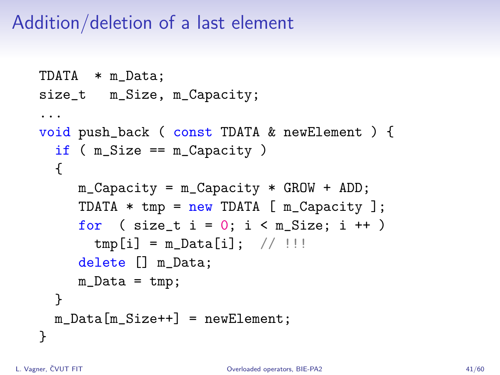

= Practical 1

**`vector` and `new[] expression`: Implementation of a simple form of a vector class with the `new[]` expression — how `vector` should not be implemented.**

== Assignment

Implement the class template `vector` in the `epc` namespace with the following interface and measure its efficiency:

[source,c++]
----
template <typename T>
class vector
{
public:
  vector() noexcept; // <1>

  vector(const vector&) = delete; // <2>
  vector& operator=(const vector&) = delete; // <3>

  ~vector(); // <4>

  T* data(); // <5>
  const T* data() const; // <5>

  T& operator; // <6>
  const T& operator const; // <6>

  void push_back(const T&); // <7>

  size_t capacity() const; // <8>
  size_t size() const; // <9>
};
----

<1> Default constructor
<2> Copy constructor
<3> Copy assignment operator
<4> Destructor
<5> Pointer to first element
<6> Reference to desired element
<7> Element insertion
<8> Information about capacity
<9> Information about number of elements

NOTE: Details about the interface are in the following section.

== Application programming interface (API)

=== Template parameters

* `T` — *value type*

=== Constructors and destructor

* `vector()` — *default constructor*
** Sets the vector into the empty state, i.e., state, where it does not contain any elements and its capacity is zero.
** Must not throw exceptions.

IMPORTANT: From the above requirements, it implies that the default constructor may not create any objects of the value type nor allocate memory.

* `vector(const vector&)` — *copy constructor*
** Copy constructor is defined as deleted.

* `operator=(const vector&)` — *copy assignment operator*
** Copy assignment operator is defined as deleted.

NOTE: Explicit deletion of the above-mentioned special member functions supresses the generation of the move constructor and the move assignment operator.

* `~vector()` — *destructor*
** If needed, destructs all the vector elements and deallocates memory.

=== Elements access

* `data()` — *pointer to the first element*
** If the vector contains some elements, returns a pointer to the first of them.
** Otherwise, returns the null pointer.

NOTE: The function exits in two variants, i.e., as a _(non-constant) member function_ and a _constant member function_.

* `operator[]` — *reference to the desired element*
** If the vector contains the element with the index `i`, returns a reference bound to it.
** Otherwise, the behavior is undefined.

NOTE: The operator exits in two variants, i.e., as a _(non-constant) member function_ and a _constant member function_.

=== Information about vector

* `capacity()` — *information about capacity*
** Returns information about the vector's capacity, i.e., the size of the array that was last time allocated by the `new[]` expression inside the `push_back` function.

* `size()` — *information about element count*
** Returns information about the vector's size, i.e., the number of elements that were inserted into it by the `push_back` function.

=== Element insertion

* `push_back(const T& value)` — *inserts element*
** Inserts, at the end of the vector, a copy of the object to which the reference `value` is bound.
** If, before the element insertion, the size of the vecotor is equal to its capacity, the capacity must be first (before insertion) extended by peforming so-called “reallocation”. This happes in the following steps:
... A new array of the value type objects is allocated by the `new T[n]` expression, where `n` generally equals the double of the current capacity. Only in case that the current capacity is zero, `n` is set to 1.
... The current vector elements are copied from the original array to the newly allocated array by using the copy assignment operator.
... The original array is destructed/deallocated by the `delete[]` expression.
... The internal vector variables are set such that their state correspond with the new array and the new capacity.

[NOTE]
====
This form of a vector and its reallocation stems from the description of the implementation of dynamic arrays as presented in the BIE-PA2 course. The copy of the corresponding slide form the course lectures which shows the `push_back` member function:

====

CAUTION: In the shown implementation, the capacity is extended in a way that does not meet the above-stated requirements for the `epc::vector` class template.

[WARNING]
====
* The shown implementation does not care about exceptions.
* The correct exceptions treatement by the vector implementation will be a part of further assignments; it does not need to be resolved here.
==== 

== Requirements for implementation

* For implementation, use a single header file `vector.h` only.
* For implementation, use the {cpp}11 standard or newer.

[WARNING]
====
* The choice of the standard needs to enable the compilation of the test and benchmark programs.
* The test program is built automatically in the GitLab system by using GCC version 11 in the Alpine Linux 3.16 environment.
* The benchmark program needs to be built on the classroom computers in the Linux environment; the available versions of the compilers may be found by the `g{plus}{plus} --version` and `clang{plus}{plus} --version` commands.
* For the support of particular features of the standards by different {cpp} implementations, see https://en.cppreference.com/w/cpp/compiler_support or the documentation for particular implementations.
====

== Solution

* A solution of the assigned programming task consists of two parts:
.. the implementation of the `epc::vector` class template,
.. the report from the measurement of its efficiency.

=== Implementation

* As a final solution is considered the content of the `vector.h` file located in the root directory of the _practical1_ branch of your course project on the faculty GitLab instance.

NOTE: The _practical1_ branch contains a template of the `vector.h` header file.

* As a correct solution is considered compilable and working implementation of the epc::vector` class template according to the above requirements.
* The functionality of the solution is automatically verified by the test program.
* The choice of the standard for testing may be done by updating the `config.mk` file.

CAUTION: In the _practical1_ branch of your course project, do not change the content of any existing file except `vector.h` and `config.mk`.

=== Efficiencny measurements

* Measure the efficiency of your implementation by the program with the source code in the `benchmark.cpp` file.
* Program porovnává na vybraných operacích efektivitu vaší implementace s třemi různými existujícími implementacemi vektorové třídy:
* The program compares the effeiciency — on some selected operations — of your implementation with three existing vector-class implementations:
.. `std::vector` from the standard {cpp} library,
.. `boost::container::small_vector` form the Boost.Container library,
.. `llvm::SmallVector` from the LLVM ADT library.
* Perform the measurements by building and running the program on the classroom computers where all the required libraries are available.
* Perform the mesurements separately for the benchmark program compiled by the GCC and Clang compilers.
* To build the benchmark program, you can use the `Makefile` file and `make benchmark-gcc` and `make benchmark-clang` commands.

==== Efficiency measurement report

* Create a simple report with the results of efficiency measurements.
* This report will have the form of the “Description” field by the _merge request_ created for the submission of your solution.
* The report will contained the mesasured time (column “Time”) for all the vector implementations.
* The report will contain the results obtained for both compilers.

== Classification

* Pokud se v rámci hodnocené GitLab _úlohy_ nepodaří testovací program vůbec přeložit kvůli chybám v implementaci, bude udělený počet bodů nulový.
* If the considered GitLab _job_ will even not be able to build the test program because of an incorrect implementation, the assignment will be classified with 0 points.
* In case that the compilation will succeed but some tests will not pass, the maximum amount of awarded points will be 5.

[IMPORTANT]
====
* In such a case, the amount of awarded classification points cannot be set only with accoding to the testing resutls.
* Instead, the code review will be performed and points will be awarded with respect to the severity of implementation errors.
====

* In case that all tests will pass and the efficiency measurement report will be submitted, the maximum amount of classification points, i.e., 10, can be awarded.

[IMPORTANT] 
====
* Even the, it may happen that the amount of classified points will be lower.
* In general, it is impossible to evaluate the correcntess of some implementation only by running tests.
* If some errors will be found during code review, the amount of awarded points will be lowered based on their severity.
====
